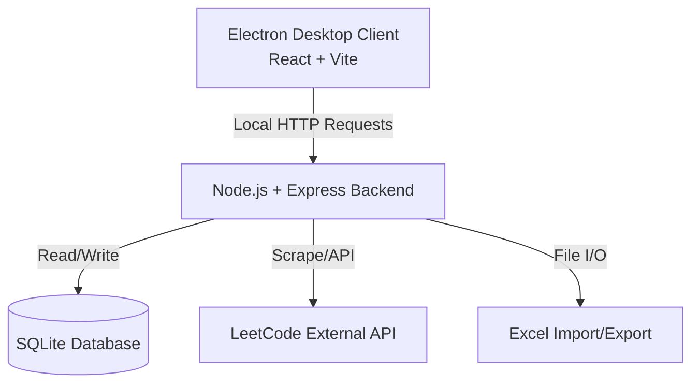
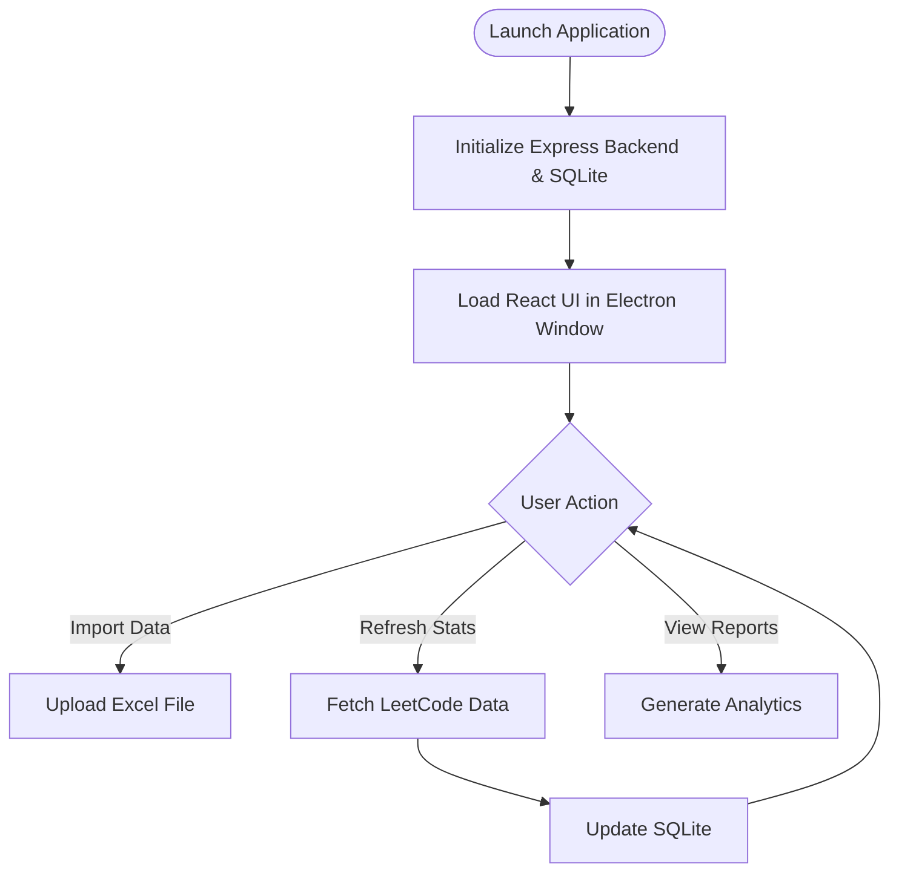
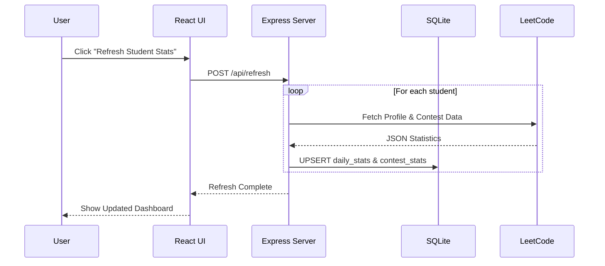
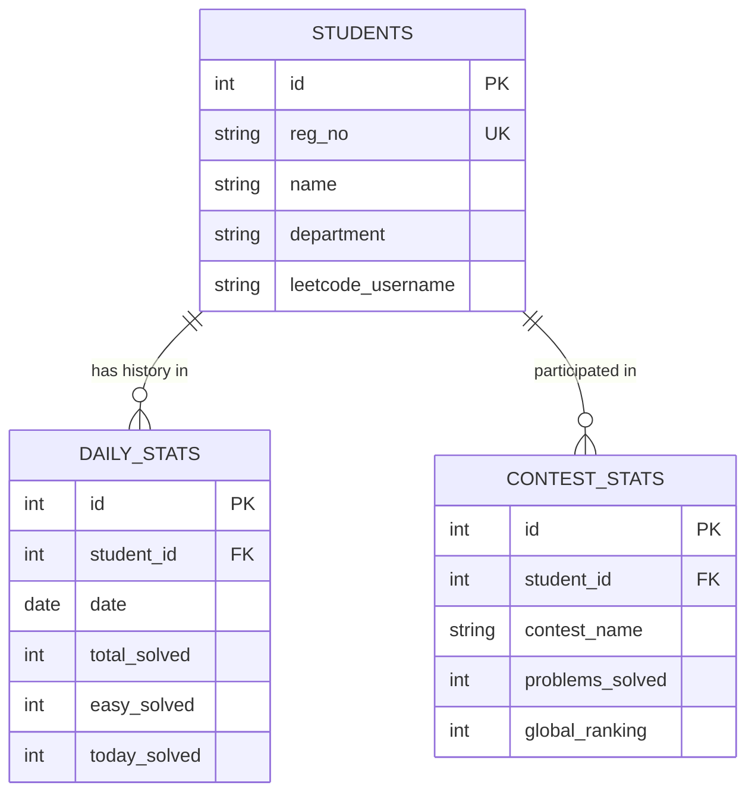
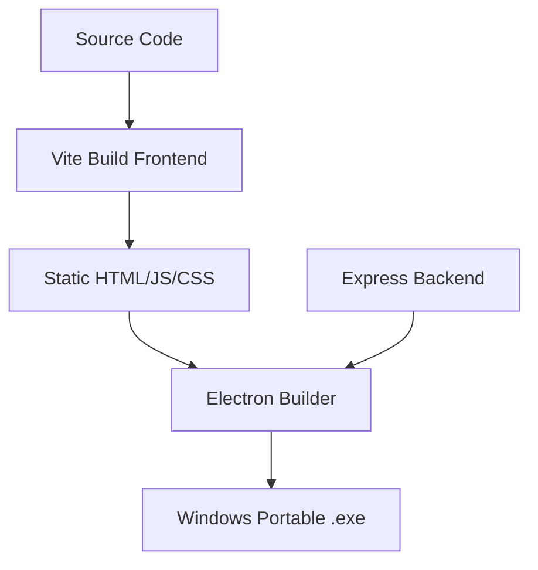

# 🚀 LEO - Desktop Student Performance Tracking Software

[]()
[]()
[]()
[](https://opensource.org/licenses/MIT)

---

## 📖 Overview

**Problem Statement:** Institutions struggle to track the daily coding progress and competitive programming performance of their students across platforms like LeetCode. Manual tracking via Excel sheets is tedious, error-prone, and doesn't scale.

**Solution:** **LEO** is a complete, offline-first Desktop Application built specifically to automate the fetching, tracking, and reporting of student LeetCode metrics. It acts as a localized tracking engine that ingests student data, communicates with LeetCode to fetch live statistics, and generates beautiful analytical dashboards and reports.

**Target Users:** College Departments, Placement Cells, Coding Clubs, and Professors aiming to monitor student coding activity effortlessly.

---

## 🧠 System Architecture

### 📊 Architecture Diagram



### 🏗️ Explanation
- **Electron Container:** The application runs as a standalone desktop app using Electron. It completely bundles the UI, backend server, and database into a single executable.
- **React Frontend:** A modern Vite-powered React Single Page Application (SPA) serving as the UI layer.
- **Express Backend:** An embedded Node.js backend running on `localhost:3001` that handles database operations, web scraping, and API orchestration.
- **SQLite Database:** A lightweight, local, zero-configuration database ensuring all student data stays private and secure on the host machine.

---

## 🔄 Application Flow

### 📌 Flowchart



---

## 🔁 Sequence Diagram



---

## 🧩 Module Breakdown

- **Import Module:** Ingests `.xlsx` files using `xlsx` and `multer`, validating student Registration Numbers, Names, Departments, and LeetCode URLs.
- **LeetCode Integration Service:** Scrapes and interacts with LeetCode to gather total solved problems (Easy, Medium, Hard), recent submissions, and Contest Ratings.
- **Student Dashboard & Analytics:** Calculates delta (Yesterday vs Today) to highlight active vs inactive students. Aggregates data by department and batch.
- **Reporting Engine:** Generates downloadable Excel reports summarizing student performance for faculty review.
- **Settings & Configuration:** Localized settings for synchronization intervals and data management.

---

## ✨ Features

* **Beginner:** 
  * Bulk import students via Excel.
  * View a comprehensive list of students and their LeetCode handles.
* **Advanced:** 
  * Automated tracking of "Problems Solved" broken down by difficulty.
  * Contest history tracking including Global Ranking and Rating changes.
  * Daily snapshots (Delta tracking: what did the student solve today?).
* **Expert:** 
  * Department-wise analytical breakdowns.
  * Completely offline-first database.
  * Portable `.exe` build via electron-builder (No installation required).

---

## 🧰 Tech Stack

* **Frontend:** React, Vite, React Router (`react-router-dom`), React Hot Toast.
  * *Why:* Provides a blazing fast, component-driven UI that feels like a native desktop app.
* **Backend:** Node.js, Express, Cors, Multer.
  * *Why:* Express provides a lightweight embedded server capable of handling file uploads and API requests locally.
* **Database:** SQLite (`sqlite`, `sql.js`).
  * *Why:* Perfect for desktop applications. Requires no separate background service (like MySQL/Postgres).
* **Data Processing:** `xlsx` (SheetJS).
  * *Why:* Industry standard for reading and generating Excel spreadsheets natively in JavaScript.
* **Desktop Wrapper:** Electron, Electron-Builder.
  * *Why:* Bundles the entire stack into a single, distributable cross-platform binary.

---

## 📂 Project Structure

### Current & Optimized Structure
```text
nandha-leet-code/
├── backend/
│   ├── database/        # SQLite initialization and schemas
│   │   ├── db.js
│   │   └── schema.sql
│   ├── routes/          # Express API controllers
│   ├── services/        # Business logic (Leetcode API, Excel parsing)
│   └── server.js        # Backend entry point
├── electron/
│   ├── main.js          # Electron window creation & lifecycle
│   └── preload.js       # IPC bridge
├── frontend/
│   ├── src/             # React source code (Pages, Components, API services)
│   └── vite.config.js
├── package.json         # Workspace and build scripts
└── start-electron.js    # Dev launcher
```

---

## ⚙️ Installation & Setup

### 🖥️ System Requirements
- Node.js v18+
- Windows (Primary target), macOS, or Linux

### 🔧 Step-by-Step Setup

1. **Clone the repository:**
   ```bash
   git clone <repository_url>
   cd nandha-leet-code
   ```

2. **Install dependencies:**
   ```bash
   npm install
   cd frontend && npm install
   cd ..
   ```

3. **Run in Development Mode:**
   ```bash
   npm run dev
   ```
   *This concurrently starts the Express server, Vite dev server, and Electron wrapper.*

### ▶️ Build for Production (Portable Executable)
```bash
npm run pack
```
*This generates an un-archived executable directory in `release/`. For a fully packaged `.exe`, use `npm run build`.*

---

## 🔐 Security & Restrictions

Because this is a **Local Desktop Application**, traditional web vulnerabilities (XSS, CSRF) have a vastly reduced attack surface. However:
- **CORS:** Currently configured to `origin: '*'` in `server.js`. Because the app binds to `127.0.0.1`, only local software can access the API, but this can be hardened.
- **Data Privacy:** All student data is stored locally in SQLite (`backend/database`). No data is sent to a centralized remote server.
- **Rate Limiting:** The backend gracefully handles LeetCode API rate limits to prevent IP bans during mass student data refreshes.

---

## 📡 API Design (Internal)

| Endpoint | Method | Description |
|----------|--------|-------------|
| `/api/health` | GET | Check if backend is active. |
| `/api/students` | GET | Retrieve paginated student stats. |
| `/api/import` | POST | Upload Excel file to parse students. |
| `/api/refresh` | POST | Trigger LeetCode data scrape for all users. |
| `/api/contests` | GET | Fetch contest performance stats. |
| `/api/reports` | GET | Generate and download Excel reports. |

---

## 🗄️ Database Design

### 📊 ER Diagram



---

## 🚀 DevOps & Deployment

### ⚙️ Build Pipeline



Electron-builder is configured to produce a **Portable** target for Windows (`x64`), making it extremely easy to distribute to faculty on standard institution laptops without requiring Admin privileges to install.

---

## 📈 Scalability & Performance

* **Concurrency:** The `leetcodeService.js` handles data fetching. For large batches (e.g., 500+ students), requests are queued or batched to prevent network congestion and LeetCode API timeouts.
* **Database Indexing:** `schema.sql` creates indices on `reg_no`, `department`, and `date` to ensure fast dashboard rendering even with years of daily statistical data.

---

## 🧹 Project Optimization Report

During the audit, the following optimizations were identified:

1. **Security Fix:** The backend `server.js` uses `app.use(cors({ origin: '*' }))`. Although bound to localhost, it is safer to restrict CORS strictly to `http://localhost:5173` (Vite) and the Electron `file://` protocol.
2. **Code Improvements:** 
   - Extract hardcoded ports (`3001`) into environment configs if needed.
   - Use `electron-log` instead of `console.log` for debugging the built portable application, as stdout is not visible in production.
3. **Structure Fixes:** 
   - Move `start-electron.js` and standalone DB test scripts (`test-db.js`, etc.) into an `internal/` or `scripts/` directory to clean up the root.

---

## 🤝 Contribution Guide

1. Fork the repository.
2. Create your feature branch (`git checkout -b feature/AmazingFeature`).
3. Commit your changes (`git commit -m 'Add some AmazingFeature'`).
4. Push to the branch (`git push origin feature/AmazingFeature`).
5. Open a Pull Request.

---

## 📜 License

Distributed under the MIT License. See `LICENSE` for more information.
